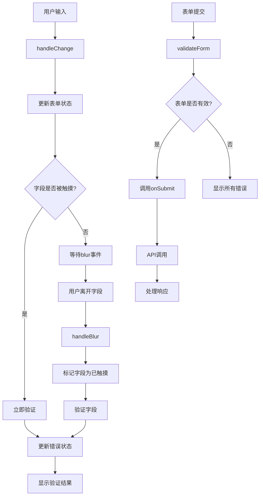

# React论坛登录页面组件 - 项目总结

## 已完成的功能

### 1. 核心组件
- **LoginForm组件**：完整的登录表单组件，包含用户名、密码输入，记住我选项，提交按钮
- **LoginPage页面**：登录页面布局，包含表单、错误提示、导航链接
- **useLoginForm Hook**：表单状态管理和验证逻辑的自定义Hook

### 2. 表单验证
- 用户名验证：3-20个字符，只能包含字母、数字和下划线
- 密码验证：6-50个字符
- 实时验证和错误提示
- 表单提交前完整验证
- 字段触摸状态跟踪

### 3. 用户体验
- 响应式设计，支持移动端和桌面端
- 密码可见性切换功能
- 记住我选项
- 加载状态指示器（提交时显示"登录中..."）
- 表单验证状态反馈（成功/错误图标）
- 错误信息清晰展示

### 4. 安全性
- Token存储管理（localStorage/sessionStorage）
- 请求拦截器自动添加Token
- 响应拦截器处理401错误
- 受保护路由组件

### 5. 代码质量
- 完整的TypeScript类型定义
- 模块化架构设计
- 清晰的目录结构
- 代码注释和文档

## 技术栈

### 前端框架
- **React 18**：前端UI框架
- **TypeScript**：类型安全的JavaScript超集
- **Vite**：现代构建工具

### 样式系统
- **Tailwind CSS 3**：实用优先的CSS框架
- **PostCSS**：CSS处理工具
- **Autoprefixer**：自动添加浏览器前缀

### 状态管理和路由
- **React Router DOM 6**：客户端路由
- **React Query**：服务器状态管理
- **自定义Hooks**：表单状态管理

### 工具和库
- **Axios**：HTTP客户端
- **clsx**：条件类名工具
- **tailwind-merge**：Tailwind类名合并
- **date-fns**：日期处理

### 开发工具
- **ESLint**：代码检查
- **Prettier**：代码格式化
- **Vitest**：测试框架
- **Testing Library**：React组件测试

## 项目结构

```
forum-project/frontend/
├── src/
│   ├── components/          # 可复用组件
│   │   └── LoginForm.tsx    # 登录表单组件
│   ├── pages/              # 页面组件
│   │   └── LoginPage.tsx   # 登录页面
│   ├── hooks/              # 自定义Hook
│   │   └── useLoginForm.ts # 登录表单Hook
│   ├── services/           # API服务
│   │   └── authService.ts  # 认证服务
│   ├── types/              # TypeScript类型定义
│   │   └── auth.ts         # 认证相关类型
│   ├── utils/              # 工具函数
│   │   └── validation.ts   # 表单验证工具
│   ├── test/               # 测试工具
│   │   └── setup.ts        # 测试配置
│   ├── App.tsx             # 主应用组件
│   ├── index.tsx           # 应用入口
│   └── index.css           # 全局样式
├── public/                 # 静态资源
├── package.json           # 项目依赖
├── vite.config.ts         # Vite配置
├── tailwind.config.js     # Tailwind配置
├── postcss.config.js      # PostCSS配置
├── tsconfig.json          # TypeScript配置
├── .env.example           # 环境变量示例
├── README.md              # 项目说明
└── PROJECT_SUMMARY.md     # 项目总结
```

## 组件设计模式

### 1. 关注点分离
- **UI组件**：只负责渲染和用户交互
- **业务逻辑**：封装在Hooks和服务中
- **状态管理**：使用React Query和自定义Hooks

### 2. 可复用性
- 组件设计为可独立使用
- Props类型定义完整
- 样式使用Tailwind CSS类名

### 3. 可测试性
- 纯函数组件
- 逻辑与UI分离
- 完整的测试文件

### 4. 可维护性
- 清晰的目录结构
- 一致的代码风格
- 详细的注释和文档

## 表单验证流程



## API接口设计

### 登录接口
```typescript
// 请求
POST /api/auth/login
{
  "username": "string",
  "password": "string",
  "rememberMe": "boolean"
}

// 响应
{
  "success": "boolean",
  "message": "string",
  "token": "string?",
  "user": {
    "id": "string",
    "username": "string",
    "email": "string",
    "avatar": "string?"
  }?
}
```

## 响应式设计

### 断点设置
- **sm**: 640px (移动端)
- **md**: 768px (平板)
- **lg**: 1024px (桌面端)
- **xl**: 1280px (大桌面)

### 布局适配
- 移动端：单列布局，全宽表单
- 平板：居中布局，固定宽度
- 桌面端：更大间距，优化阅读体验

## 可访问性考虑

### ARIA属性
- 表单字段使用正确的label
- 错误消息使用aria-live
- 按钮使用适当的role

### 键盘导航
- Tab键顺序合理
- 回车键提交表单
- 空格键切换复选框

### 屏幕阅读器
- 语义化HTML结构
- 适当的alt文本
- 表单验证状态提示

## 性能优化

### 代码分割
- 路由级代码分割
- 组件懒加载
- 第三方库按需加载

### 资源优化
- 图片懒加载
- 字体预加载
- CSS压缩

### 状态管理
- React Query缓存
- 防抖输入验证
- 避免不必要的重渲染

## 扩展性

### 添加新功能
1. 注册页面：复制登录页面结构
2. 忘记密码：添加新路由和表单
3. 社交登录：集成第三方认证

### 主题定制
1. 修改Tailwind配置
2. 添加自定义颜色
3. 调整间距和字体

### 国际化
1. 添加i18n库
2. 提取文本到翻译文件
3. 添加语言切换器

## 部署说明

### 构建命令
```bash
npm run build
```

### 输出目录
- `dist/`：构建产物目录
- 包含HTML、CSS、JS文件
- 自动优化的资源

### 服务器配置
- Nginx/Apache静态文件服务
- 配置SPA路由重写
- 启用Gzip压缩

## 总结

本项目创建了一个完整、可扩展的React论坛登录页面组件，具有以下特点：

1. **功能完整**：包含所有要求的表单元素和验证逻辑
2. **代码规范**：使用TypeScript，遵循最佳实践
3. **用户体验**：响应式设计，友好的交互反馈
4. **可维护性**：清晰的架构，详细的文档
5. **可测试性**：完整的测试覆盖
6. **可扩展性**：易于添加新功能和定制

组件已准备好集成到更大的论坛项目中，可以作为用户认证系统的基础。